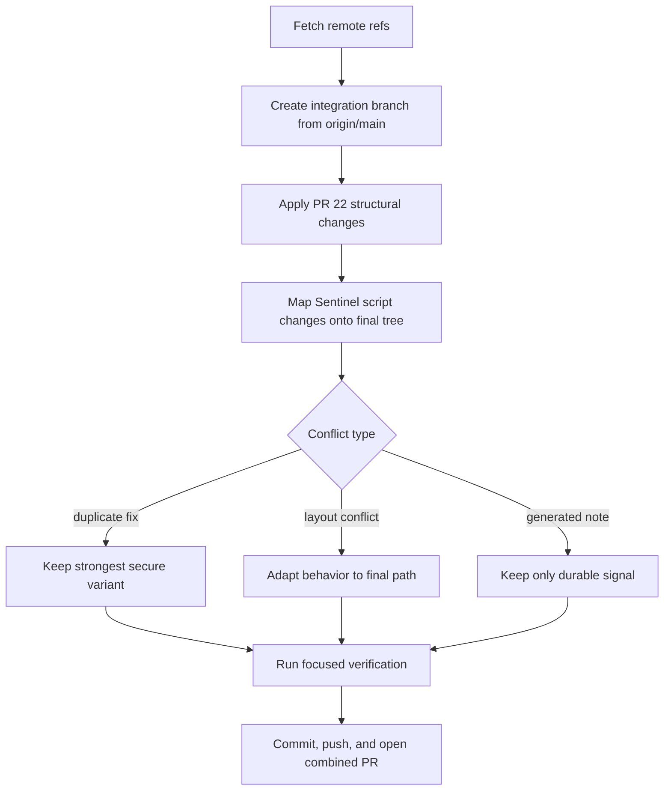

# Combine Open Pull Requests - Plan

<!-- markdownlint-disable MD013 -->

## Goal Capsule

| Field | Value |
|---|---|
| Objective | Create one integration branch and pull request that combines every currently open `dreamora/dotfiles` PR targeting `main`. |
| Authority | Preserve user-requested scope first, then repo install/symlink contracts, then individual PR intent, then generated PR metadata. |
| Execution profile | Branch from up-to-date `origin/main`, apply each open PR's effective changes, resolve conflicts once, verify the combined result, and ship a professional PR. |
| Stop conditions | Stop only for an unresolvable semantic conflict, an unavailable remote after a remote was already confirmed, or verification failure that cannot be repaired without changing scope. |
| Tail ownership | The final PR body must list source PRs, conflict-resolution choices, and verification results so the old PR set can be closed or superseded. |

---

## Product Contract

### Summary

The repository has 14 open pull requests against `main`: 13 Sentinel shell-hardening PRs that overlap heavily on utility scripts and one larger modular cross-platform restructure PR.
The requested outcome is a single path forward: one branch and one PR containing the combined useful changes with conflicts resolved intentionally.

### Problem Frame

The open PR set cannot be merged mechanically in arbitrary order.
The Sentinel PRs repeatedly edit `scripts/convert-android-keystore.sh`, `scripts/delete_files.sh`, `scripts/line_extract.sh`, and sometimes `.jules/sentinel.md`.
PR #22 changes repository structure at much larger scale, including installer, package, config, and documentation layout.
The integration branch must preserve the current `main` contract where it remains authoritative, adopt the newer modular restructure where it is the intended replacement, and carry forward the script hardening as a superset rather than a chain of conflicting variants.

### Requirements

**PR inventory and scope**

- R1. Include every open pull request returned by GitHub for `dreamora/dotfiles` targeting `main`, including draft PRs, as an integration input.
- R2. Keep a source-PR manifest in the final PR description so reviewers can trace which PRs are superseded.

**Conflict resolution**

- R3. Resolve overlapping Sentinel changes into one hardened implementation for each affected script rather than preserving duplicate or weaker variants.
- R4. Treat PR #22's modular restructure as a broad layout input while preserving any newer `main` behavior that supersedes it.
- R5. Resolve generated `.jules/sentinel.md` conflicts by preserving durable security signal only when it still belongs in the restructured repository; do not restore generated task-provenance noise solely because older PRs touched it.

**Repository behavior**

- R6. Preserve executable script behavior for Android keystore conversion, line extraction, file deletion, package installation, and folder-contract verification.
- R7. Keep shell changes portable and consistent with repo guidelines: `#!/usr/bin/env bash`, strict mode where safe, quoted variables, `--` delimiters for user-controlled operands, and secure temporary-file handling for sensitive data.
- R8. Keep the Stow mapping contract clear: `homedir/` targets `$HOME`, `config/` targets `~/.config`, and scripts remain globally linkable utilities.

**Shipping**

- R9. Create a new branch with the combined changes, not a direct mutation of `main`.
- R10. Push the combined branch and open a professional PR when the configured remote is available.

### Source Pull Requests

| PR | Status | Head branch | Main change surface |
|---|---|---|---|
| #60 | Ready | `sentinel-harden-utility-scripts-12195558744534481519` | Harden `convert-android-keystore.sh`, `delete_files.sh`, and `line_extract.sh`. |
| #59 | Ready | `security-hardening-scripts-14850642503095277671` | Similar shell hardening plus `.jules/sentinel.md`. |
| #58 | Ready | `sentinel-harden-keystore-script-2758194854902518266` | Harden Android keystore conversion. |
| #57 | Ready | `sentinel-fix-option-injection-16335951249766025241` | Fix option injection in file utilities plus keystore changes. |
| #56 | Draft | `sentinel/harden-utility-scripts-8285012484273977503` | Earlier combined utility hardening. |
| #55 | Draft | `sentinel-harden-keystore-script-11444153802782233601` | Earlier keystore hardening. |
| #54 | Draft | `sentinel/fix-line-extract-injection-13671431596039938661` | Earlier `line_extract.sh` option-injection fix. |
| #53 | Draft | `sentinel-security-hardening-scripts-4380760994659618611` | Earlier multi-script hardening. |
| #52 | Draft | `sentinel-harden-keystore-script-7161243673358380842` | Earlier keystore temp-file and secret handling fix. |
| #51 | Draft | `sentinel/harden-keystore-script-1380104999142665950` | Earlier keystore secret/temp hardening. |
| #50 | Draft | `sentinel/harden-keystore-script-9842201490728885722` | Earlier keystore hardening. |
| #49 | Draft | `sentinel-harden-line-extract-1642912964176480512` | Earlier `line_extract.sh` option-injection fix plus Sentinel note. |
| #48 | Draft | `sentinel/fix-option-injection-line-extract-7520173212927255603` | Earlier `line_extract.sh` option-injection fix plus Sentinel note. |
| #22 | Ready | `feat/modular-restructure` | Modular cross-platform dotfiles restructure across installer, packages, config, home files, workflows, and docs. |

### Scope Boundaries

- This plan does not merge source PR branches one by one into `main`; it creates a new integration branch from the current remote base.
- This plan does not preserve weaker duplicate implementations when multiple Sentinel PRs fix the same vulnerability.
- This plan does not remove local untracked files or unrelated user work.
- This plan does not perform destructive package cleanup or local machine mutation during verification.

---

## Planning Contract

### Key Technical Decisions

- KTD1. **Start from `origin/main`, not local `main`.** The local branch is behind by 3 commits, so the integration branch must be based on the remote tracking state after fetching to avoid resurrecting stale base content.
- KTD2. **Use PR #22 as the structural baseline after validating it against current `main`.** It is the only PR that intentionally changes repository layout at scale; conflict resolution should adapt Sentinel hardening into whichever script locations survive that structure.
- KTD3. **Collapse Sentinel branches by vulnerability outcome.** The newest ready Sentinel PRs carry the broadest descriptions, but the final code should be judged by hardening properties: strict error handling, argument validation, secure temp directories, command-scoped secrets, cleanup traps, option delimiters, and safe target paths.
- KTD4. **Generated Sentinel journal changes are low authority.** `.jules/sentinel.md` changes are not user-facing dotfile behavior; retain only durable security context when compatible with the final tree.
- KTD5. **Prefer validation already present in the repo.** This repository has no formal test suite, so verification should use shell syntax checks, folder-contract checks, Git config parsing, manifest validation where available, and targeted behavioral probes for modified scripts.

### High-Level Technical Design

### Assumptions

- The phrase "all open pull request" includes draft PRs because GitHub reports them as open.
- The phrase "single path" means one branch and PR that supersedes the open PR set.
- If two PRs make mutually exclusive edits to generated notes, durable repository behavior outranks generated provenance.

### Sources and Research

- GitHub open PR metadata collected on 2026-07-06 for PRs #22 and #48 through #60.
- Current local `main` was clean but behind `origin/main` by 3 commits at planning time.
- `docs/plans/2026-05-18-001-fix-ci-merge-conflicts-plan.md` shows the repo's prior conflict-resolution posture: preserve newer `main` contracts while carrying branch intent forward.
- Repository guidance in `AGENTS.md` defines the Stow layout, script style, package manifests, and verification commands.

---

## Implementation Units

### U1. Inventory and Base the Integration Branch

**Goal:** Establish the exact open PR input set and create the combined branch from current `origin/main`.

**Requirements:** R1, R2, R9

**Dependencies:** None

**Files:**

- Tracked files: none
- Non-tracked artifact: integration branch metadata
- Review artifact: source PR metadata in the final PR body

**Approach:** Fetch `origin`, confirm the open PR list has not materially changed since planning, create a `codex/` integration branch from `origin/main`, and keep a working manifest of PR numbers, head branches, draft states, and touched files for the PR description.

**Patterns to follow:** Branch prefix guidance from the Codex app context and prior repo conflict-resolution practice.

**Test scenarios:**

- Happy path: all 14 planning-time open PRs are present in the source manifest.
- Edge case: if a PR closed during execution, record that state and decide whether its already-reviewed changes still belong based on user scope and branch availability.
- Error path: if `origin/main` cannot be fetched, stop before creating a stale integration branch.

**Verification:** The new branch points at the fetched `origin/main` base before integration changes are applied.

### U2. Apply the Modular Restructure Safely

**Goal:** Bring PR #22's modular repository layout into the integration branch without losing newer base behavior.

**Requirements:** R4, R8

**Dependencies:** U1

**Files:**

- Modify: `install.sh`
- Modify: `install_packages.sh`
- Modify: `README.md`
- Modify: `.gitignore`
- Modify: `.gitmodules`
- Modify: `.github/workflows/bootstrap.yml`
- Modify: `.github/workflows/reliability-gates.yml`
- Modify: `.github/workflows/syntax-gate.yml`
- Modify: `homedir/.gitconfig`
- Modify: `homedir/.zshrc`
- Create/modify: `lib/`
- Create/modify: `machines/`
- Create/modify: `homedir-common/`
- Create/modify: `homedir-darwin/`
- Create/modify: `homedir-linux/`
- Create/modify: `configs-darwin/`
- Create/modify: `configs-linux/`
- Create/modify: `configs/nvim/`
- Test: `install.sh`
- Test: `install_packages.sh`
- Test: `.github/workflows/*.yml`

**Approach:** Apply PR #22 as the broad tree transformation, then inspect conflicts against current `origin/main` and keep newer manifest, workflow, ignore, and local-tooling contracts where they supersede the PR branch.

**Patterns to follow:** Existing Stow separation in repository guidance and the prior conflict-resolution plan's preference for newer `main` installer/package contracts.

**Test scenarios:**

- Happy path: modular directories exist and installer references the intended library/package sources.
- Happy path: `homedir/` and `config/` contracts remain understandable after the restructure.
- Edge case: files renamed by PR #22 are not accidentally duplicated at old and new locations unless compatibility requires both.
- Error path: workflow files and install scripts contain no conflict markers.
- Integration: folder-contract verification still understands the final directory shape.

**Verification:** Git reports no unresolved merge state, key shell files parse, and the final diff shows an intentional layout transformation rather than a partial cherry-pick.

### U3. Port Sentinel Script Hardening onto the Final Tree

**Goal:** Preserve the effective security fixes from PRs #48 through #60 in the final script locations.

**Requirements:** R3, R5, R6, R7

**Dependencies:** U2

**Files:**

- Modify: `scripts/convert-android-keystore.sh`
- Modify: `scripts/delete_files.sh`
- Modify: `scripts/line_extract.sh`
- Modify or omit: `.jules/sentinel.md`
- Test: `scripts/convert-android-keystore.sh`
- Test: `scripts/delete_files.sh`
- Test: `scripts/line_extract.sh`

**Approach:** Compare the Sentinel PR variants by vulnerability outcome, not commit order, and implement the strongest combined behavior in the final tree: portable Bash shebangs, strict mode where compatible, argument validation, quoted variables, `mktemp -d` with cleanup traps for sensitive keystore intermediates, command-scoped secrets where feasible, `grep -e --` for user patterns and files, and safe handling for dash-prefixed find targets.

**Execution note:** Add characterization-style checks before and after script edits where practical because these utilities have no dedicated test harness.

**Patterns to follow:** Shell script guidelines in `AGENTS.md`, helper-script validation style in `scripts/verify_folder_contracts.sh`, and Sentinel PR intent captured in the source PR bodies.

**Test scenarios:**

- Happy path: `line_extract.sh` finds a normal pattern in a normal file.
- Edge case: `line_extract.sh` treats a pattern beginning with `-` as a literal pattern, not a `grep` option.
- Edge case: `line_extract.sh` accepts a file path beginning with `-` when passed through an explicit relative path or delimiter-safe invocation.
- Happy path: `delete_files.sh` deletes files matching a normal pattern under a normal directory.
- Edge case: `delete_files.sh` handles a target directory beginning with `-` without passing it to `find` as an option.
- Error path: `delete_files.sh` exits clearly when the target directory does not exist.
- Happy path: `convert-android-keystore.sh` writes only the requested output keystore path for valid inputs.
- Error path: `convert-android-keystore.sh` removes temporary certificate and PKCS#12 files on failure or interruption.
- Integration: all three scripts pass Bash syntax checks after the combined hardening.

**Verification:** Targeted command probes demonstrate option-injection hardening and no sensitive intermediate files are left in the working directory by the keystore script.

### U4. Reconcile Documentation, Generated Notes, and PR Narrative

**Goal:** Make the combined branch reviewable without preserving misleading generated or duplicate metadata.

**Requirements:** R2, R5, R10

**Dependencies:** U2, U3

**Files:**

- Modify: `README.md`
- Modify or omit: `.jules/sentinel.md`
- Review artifact: final PR body

**Approach:** Keep README and repository docs consistent with the final directory structure and package-management flow.
For `.jules/sentinel.md`, either omit it when the final structure removes it or replace it with concise durable context only if the file remains part of the repo.
Write the PR body to explain that the combined branch supersedes the open PR set, list source PRs, and summarize conflict-resolution choices.

**Patterns to follow:** Existing PR descriptions and repository guidance that `.compound-engineering/solutions/` is the durable learning location, while `docs/` is not used for AI learning artifacts.

**Test scenarios:**

- Happy path: README setup instructions match the final installer flags and directory layout.
- Happy path: the PR body lists every source PR number.
- Edge case: generated Sentinel note content does not contradict the final script implementation or repository structure.

**Verification:** Reviewers can understand what was combined and why without opening each superseded PR first.

### U5. Verify, Commit, Push, and Open the Combined PR

**Goal:** Ship the combined integration branch with focused local verification and remote PR setup.

**Requirements:** R6, R7, R9, R10

**Dependencies:** U1, U2, U3, U4

**Files:**

- Test: `scripts/convert-android-keystore.sh`
- Test: `scripts/delete_files.sh`
- Test: `scripts/line_extract.sh`
- Test: `scripts/verify_folder_contracts.sh`
- Test: `install.sh`
- Test: `install_packages.sh`
- Test: `.github/workflows/bootstrap.yml`
- Test: `.github/workflows/reliability-gates.yml`
- Test: `.github/workflows/syntax-gate.yml`

**Approach:** Run shell syntax validation and repository contract checks available locally, add targeted script behavior probes that avoid destructive machine mutation, inspect the final diff against `origin/main`, commit with a conventional message, push the branch, and create the professional PR.

**Patterns to follow:** Repo guidance that no formal `npm test` suite exists, plus shellcheck/stylua/eslint only for relevant touched surfaces.

**Test scenarios:**

- Happy path: Bash syntax checks pass for every modified shell script.
- Happy path: folder-contract validation passes after the restructure and script changes.
- Happy path: package manifest checks pass when the final installer still supports them.
- Error path: no unresolved conflict markers remain in touched text files.
- Integration: final PR checks run against the single combined branch instead of the superseded PR branches.

**Verification:** Local verification passes, the branch is pushed, and the opened PR references the source PRs and validation results.

---

## Verification Contract

| Gate | Applies to | Done signal |
|---|---|---|
| Conflict marker scan | U2, U3, U4 | No active conflict markers remain in touched text files. |
| Shell syntax checks | U2, U3, U5 | Modified Bash scripts parse successfully. |
| Folder contract check | U2, U5 | `scripts/verify_folder_contracts.sh` passes against the final tree. |
| Targeted utility probes | U3, U5 | `line_extract.sh` and `delete_files.sh` handle dash-prefixed inputs safely; keystore conversion leaves no known intermediate files in the working directory. |
| Manifest/install checks | U2, U5 | Available non-mutating package manifest validation passes, or the PR records why a mutating installer path was not executed locally. |
| PR readiness | U4, U5 | Final PR body lists source PRs, conflict-resolution choices, and local verification results. |

---

## Definition of Done

- The integration branch is created from current `origin/main`.
- Every planning-time open PR is either incorporated directly or explicitly represented by a stronger equivalent conflict-resolution choice.
- Duplicate Sentinel variants are collapsed into one hardened script result.
- PR #22's restructure is applied consistently or any rejected portion is explained in the PR body.
- Local verification gates in the Verification Contract pass or have documented, non-scope-changing limitations.
- Abandoned merge/cherry-pick artifacts, temporary files, and failed-approach code are removed from the final diff.
- A conventional commit exists on the integration branch.
- The branch is pushed and a professional PR is opened when the remote is available.
