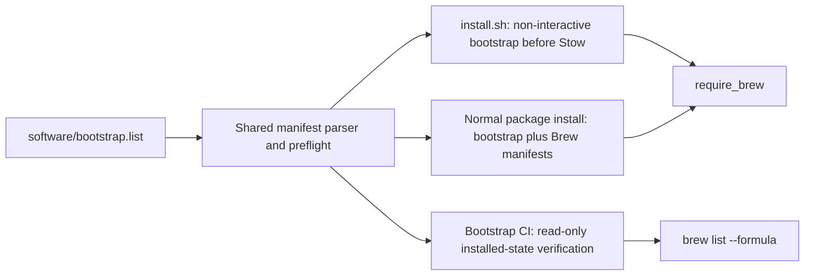

# Manifest-Owned Bootstrap Formulae - Plan

## Goal Capsule

- **Objective:** Make one software manifest own the Homebrew formulae required before dotfile symlinking, with local installation and Bootstrap CI consuming that same contract.
- **Authority:** `software/*.list` and `software/README.md` define package ownership; `AGENTS.md` defines repository conventions; existing pre-Stow behavior defines sequencing.
- **Stop conditions:** Do not address the realpath symlink finding, the separate preinstalled-Stow finding, other P2 review findings, or unrelated shell modernization.
- **Execution profile:** Two dependency-ordered implementation units on the existing `modernize-shell` branch, preserving unrelated working-tree changes.
- **Tail ownership:** Finish with focused installer simulations, shell/static checks, manifest validation, workflow parsing, and a final diff review. Do not claim a cold-install proof for Stow while CI still preinstalls it.

## Product Contract

### Summary

Introduce a common-only bootstrap formula manifest and make the installer expose non-interactive install and installed-state verification paths over it. Local setup, the normal package flow, and Bootstrap CI will share the manifest without duplicating package arrays.

### Problem Frame

`software/README.md` declares `software/*.list` canonical, but the bootstrap formula set is repeated in `software/brew.list`, direct `require_brew` calls and a shell loop in `install.sh`, and `required_formulae` in Bootstrap CI. Those copies can drift, while the generic manifest installer skips package installation whenever `CI` is set.

The bootstrap phase must remain before Stow because the shell configuration expects those commands on first launch. CI also needs a read-only installed-state check that uses the same parser and package names as installation.

### Requirements

#### Package ownership

- R1. A root-level bootstrap manifest is the only inventory location for the formulae required before Stow.
- R2. Bootstrap formulae are moved out of `software/brew.list`; they are not copied into a second package list or executable array.
- R3. Bootstrap remains a common-only contract; private and business profiles continue to be additive overlays for non-bootstrap manifests.
- R4. Full and `--check` modes reject duplicate formula ownership within the bootstrap manifest or between it and active Brew manifests.

#### Installation behavior

- R5. `install.sh` installs the complete bootstrap manifest before Stow and fails immediately when bootstrap installation fails.
- R6. Bootstrap installation is non-interactive and runs when `CI=true`; the generic CI skip remains unchanged for later optional package groups.
- R7. A normal `install_packages.sh` run includes bootstrap and regular Brew formulae in the existing Homebrew category, preserving the complete package set and prompt shape.
- R8. Custom software directories remain supported and must provide a non-empty root bootstrap manifest.
- R9. Bootstrap input is fully checked for missing, empty, malformed, and duplicate entries before the first bootstrap formula is installed.
- R10. Ruby installation receives the existing `RUBY_CONFIGURE_OPTS` through the child installer process.

#### CI verification

- R11. Bootstrap CI verifies installed formulae by invoking the shared installer contract, not by maintaining a workflow-local package array.
- R12. Verification is read-only, reports every missing bootstrap formula, and exits nonzero when any formula is absent.
- R13. Existing pull-request path filters continue to trigger Bootstrap CI for the manifest and all consumers without unnecessary expansion.

### Key Flows

- F1. **Local bootstrap:** resolve a software directory, preflight its bootstrap manifest, install missing formulae through `require_brew`, then proceed to Stow.
- F2. **Normal package install:** preflight bootstrap ownership, prompt once for Homebrew utilities, then process bootstrap formulae before regular common and profile Brew formulae.
- F3. **CI bootstrap and verification:** run local bootstrap behavior with `CI=true`, then validate installed state from the same manifest without installing or prompting.

### Acceptance Examples

- AE1. With `CI=true` and a fake Brew provider reporting every formula absent, bootstrap-install mode attempts every effective line in `software/bootstrap.list`.
- AE2. With all bootstrap formulae installed except two, bootstrap-verify mode reports both missing names and exits nonzero without invoking `brew install`.
- AE3. A missing, comment-only, malformed, or internally duplicated bootstrap manifest fails before any bootstrap installation.
- AE4. A formula present in both `bootstrap.list` and an active `brew.list` makes full install and `--check` fail with both source paths identified.
- AE5. Re-running bootstrap installation against an already-satisfied manifest performs no installations and succeeds.

### Scope Boundaries

- Keep Bootstrap CI's separate `brew install stow` step; removing it belongs to the existing P2 finding.
- Do not change symlink target verification or address the realpath finding.
- Do not alter shell runtime behavior, package selections, overlay semantics, or unrelated manifests.
- Do not add path filters already covered by `install.sh`, `install_packages.sh`, `lib_sh/**`, and `software/**`.

## Planning Contract

### Key Technical Decisions

- KTD1. Add `software/bootstrap.list` using the existing Brew line grammar, and move all 16 currently verified bootstrap formulae there. Normal Brew processing reads it before `software/brew.list`.
- KTD2. Add mutually exclusive `--bootstrap-install` and `--bootstrap-verify` modes to `install_packages.sh`. They accept an optional software directory, reject profile arguments and other modes, and never read profile overlays.
- KTD3. Reuse `trim_manifest_line`, `validate_manifest_line`, and `require_brew`; keep the implementation compatible with macOS Bash 3.2 by using indexed arrays and simple loops rather than associative arrays or `mapfile`.
- KTD4. Preload and validate bootstrap entries before installation. Full and check modes additionally compare parsed formula names against active Brew manifests to enforce exclusive ownership.
- KTD5. Installed-state verification uses each parsed formula name, ignores Brew option metadata for the lookup, aggregates failures, and never calls the installation helper.
- KTD6. Export `RUBY_CONFIGURE_OPTS` in `install.sh` before invoking bootstrap-install mode so Ruby preserves the current build configuration across the process boundary.

### High-Level Technical Design

The exact function layout remains implementation-owned; the required data flow is:



### Implementation Constraints

- Preserve the existing optional software-directory and profile syntax for normal and check modes.
- Bootstrap-only modes require only `bootstrap.list`; full and check modes continue to require every documented root manifest.
- Bootstrap preflight happens before bootstrap mutation, but earlier Homebrew/system setup is not transactional. Idempotence is the recovery mechanism.
- Leave the generic `CI` skip in `install_type` intact; only explicit bootstrap-install bypasses it.
- Preserve all unrelated dirty-tree edits, including the broader workflow and shell-runtime changes.

### System-Wide Impact

- **Local setup:** package ownership moves, but the pre-Stow install boundary and final package set remain unchanged.
- **CI:** the workflow delegates verification to repository code; `software/**` and installer changes already trigger the path-filtered job.
- **Custom manifests:** maintainers must add the new required root manifest and receive an early descriptive failure if it is absent or empty.

### Sources & Research

- `AGENTS.md`
- `software/README.md`
- `docs/plans/modernisation.md`
- `install.sh`
- `install_packages.sh`
- `lib_sh/requirers.sh`
- `.github/workflows/bootstrap.yml`
- `.github/workflows/syntax-gate.yml`
- Git history for manifest consolidation and the pre-Stow shell-tool bootstrap

No repository solution corpus was available in this checkout, and external research was not load-bearing for this repository-local contract.

## Implementation Units

### U1. Establish the bootstrap manifest and installer contract

- **Goal:** Give bootstrap formulae one owner and expose safe install and verify operations over it.
- **Requirements:** R1-R4, R6-R9, R11-R12
- **Files:** `software/bootstrap.list`, `software/brew.list`, `install_packages.sh`, `software/README.md`
- **Approach:** Move the existing 16 bootstrap formulae into the new root manifest. Extend argument parsing with mutually exclusive bootstrap modes, preload effective entries, reject invalid or duplicated ownership, include bootstrap entries in normal Brew processing, and implement aggregate read-only verification.
- **Dependencies:** None.
- **Test scenarios:**
  - **Happy path:** `--check combined` validates the new manifest; fake Brew runs show bootstrap-install reaches every entry under `CI=true` and bootstrap-verify succeeds when all are installed.
  - **Edge cases:** Comments, blank lines, Brew option metadata, an already-satisfied rerun, and an explicit custom software directory preserve expected behavior.
  - **Error paths:** Missing, empty, malformed, internally duplicated, cross-manifest duplicated, and partially installed bootstrap sets fail with descriptive nonzero results.
  - **Integration:** A normal profile run sees bootstrap plus common and active overlay Brew manifests while retaining one Homebrew prompt.
- **Verification:** Run the focused fake-Brew harness, `./install_packages.sh --check combined`, `bash -n install_packages.sh`, and ShellCheck at error severity.

### U2. Route local bootstrap and CI through the shared contract

- **Goal:** Remove executable package arrays while preserving setup sequencing and workflow coverage.
- **Requirements:** R5, R10-R13
- **Files:** `install.sh`, `.github/workflows/bootstrap.yml`
- **Approach:** Export the Ruby configuration, replace direct bootstrap installs with the shared install mode before Stow, remove the later redundant Mise requirement, and replace the workflow array with the shared verification mode. Keep the separate Stow preinstall and all unrelated workflow changes.
- **Dependencies:** U1.
- **Test scenarios:**
  - **Happy path:** Static inspection shows no bootstrap package array in either consumer, and both point to the shared installer modes.
  - **Edge cases:** Re-running local bootstrap is idempotent; the current path filters still cover every changed contract surface.
  - **Error paths:** A failed bootstrap install stops before Stow; a missing installed formula makes the CI verification command fail.
  - **Integration:** Shell syntax, workflow YAML parsing, folder-contract checks, and the existing combined manifest gate pass together.
- **Verification:** Run the full Verification Contract and inspect the scoped diff against the original finding.

## Verification Contract

### Focused behavioral proof

- Run bootstrap-install under `CI=true` with a temporary fake `brew` command that reports packages absent and records installs; compare the recorded names with parsed `software/bootstrap.list`.
- Re-run with fake Brew reporting all packages installed and assert no install calls occur.
- Run bootstrap-verify once with all names installed and once with multiple names missing; assert success in the first case and aggregate nonzero failure in the second.
- Exercise a custom directory lacking `bootstrap.list`, an empty manifest, a malformed entry, and duplicate ownership; assert each fails before an install call.

### Repository gates

```bash
bash -n install.sh install_packages.sh
shellcheck --severity=error --shell=bash --exclude=SC1090,SC1091,SC1087 install.sh install_packages.sh lib_sh/requirers.sh
./install_packages.sh --check combined
./scripts/verify_folder_contracts.sh
yq eval '.' .github/workflows/bootstrap.yml >/dev/null
git diff --check
! rg -n 'required_formulae|for shellpkg in' install.sh .github/workflows/bootstrap.yml
```

### Environment-dependent gates

```bash
./install_packages.sh --bootstrap-verify ./software
```

After the branch is pushed, both Bootstrap CI matrix jobs and Syntax Gate must pass. The existing Stow preinstall means those jobs verify declared installed state for Stow but do not prove a cold install of that one formula.

## Definition of Done

- The 16 bootstrap formulae each appear in exactly one package manifest and in no executable array.
- Local setup installs the manifest before Stow, including under `CI=true`, and exports the Ruby build configuration to the child installer.
- Normal package installation preserves the complete package set, profile overlays, custom directory behavior, and idempotence.
- Bootstrap verification is manifest-backed, read-only, aggregate, and failing when any formula is missing.
- Missing, empty, malformed, and duplicate bootstrap ownership cases fail descriptively before bootstrap mutation.
- Documentation names the new manifest, modes, grammar, common-only semantics, and custom-directory requirement.
- U1 and U2 verification passes; no abandoned helper, duplicate parser, debug output, or unrelated cleanup remains in the diff.
